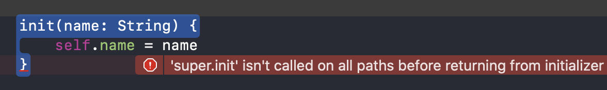
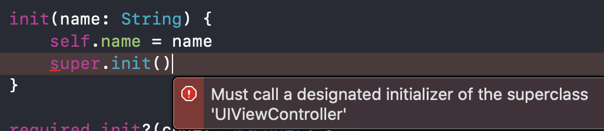

# Custom initializers for subclasses of UIViewController

First of all, what is custom initialization?

Custom initialization can fall into 2 different cases, when creating a new initializer and overriding UIViewController initializer. From my experience, It's rare that I need to override the initializer of UIViewController. I think I only have created new initializers rather than overriding.


1. Creating a new designated(?) initializer
```Swift
class CustomViewController: UIViewController {
    let name: String
    
    init(name: String) {
        self.name = name
    }
}
```

2. Overriding a initializer of super
```Swift
override init(nibName nibNameOrNil: String?, bundle nibBundleOrNil: Bundle?) {
    <#code#>
}
```

## How to add a custom initializer

As an iOS developer, you might want to use custom initializer in your UIViewController subclass from time to time to control dependency injection. When adding a custom initializer to UIViewController, you need to consider 3 different cases and I will cover all of them.

1. Initializing UIViewController programmatically
2. Initializing UIViewController using XIB
3. Initializing UIViewController from storyboard 


### required initialzer
For all three cases when you write custom initializers, Xcode will complain you should provide require init?(coder: NSCoder) which is used to create UIViewController from storyboard. The decoder, NSCoder is related to the Interface Builder. Xcode translate everything you set and do in Interface builder to code under the hood.
<p align = "left">

</p>
You need to implement required initializer regardless of you are using storyboard or not, because it is marked as required by super view.

If you are not using storyboards or your view controller has properties to be initialized, you implement below.
This won’t be crashing because this will never be called by storyboard.
```Swift
required init?(coder aDecoder: NSCoder) {
    fatalError("We aren't using storyboards")
}
```


Or you can just reference the fatal error with the super.
```Swift
required init?(coder aDecoder: NSCoder) {
    super.init(coder: aDecoder)
}
```

Keeping this required init in mind, what you need to do for each case.

### 1. The programmatically created custom initializer for a subclass of UIViewController.
```Swift
init(name: String) {
    self.name = name
}
```
After initializing custom class you should call designated initializer of super to initilize its own properties.
<p align = "left">

</p>

You should call the designated initializer for UIViewController, initWithNibName:bundle:
<p align = "left">

</p>

The final result is
```Swift
class CodeBasedViewController: UIViewController {

    private let data: String

    init(data: String, viewModel: String? = nil) {
        self.data = data
        super.init(nibName: nil, bundle:nil)
    }

    required init?(coder: NSCoder) {
        fatalError("Never will happen")
    }
}
```

### 2. The custom initializer for a XIB based UIViewController
Adding custom initializer to XIB based UIViewController is pretty similar

```Swift
class XIBBasedViewController: UIViewController {

@IBOutlet weak var titleLabel: UILabel!
private let titleData: String

init(data: String) {
    self.titleData = data
    super.init(nibName: nil, bundle: nil)
}

required init?(coder: NSCoder) {
    fatalError("init(coder:) has not been implemented")
}
```


### 3. The custom initializer for a UIViewController subclass from storyboard 
In iOS 12 and earlier, you can't use custom initializers for a UIViewController subclass created from storyboard.
In iOS 13 and later, however, Apple provides a way to use custom initializers for a Storyboard based UIViewController with some limitations. -i.e., you can’t use this on relationship segue like navigation controller root view.

https://sarunw.com/posts/better-dependency-injection-for-storyboards-in-ios13/


## How to add a convenience initializer in UIViewController

Convenience initializers are in addition to designated initializers rather than a replacement.

Convenience initializers should end up with calling designated initializers. Make sure your properties have default values or are optionals to call self.init().

```Swift
private var initialData: String = ""

convenience init(initialData: String) {
    // To call self.init(), every properties should have default values or be optionals
    self.init()
    self.initialData = initialData
    print("convenience init")
}
```
